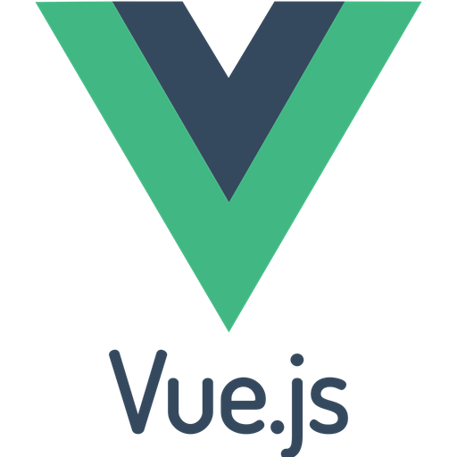
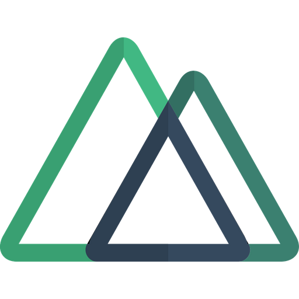

### Hi there 👋 My name is Sanjar

## I'm a Front-end | Vue.js developer.

Here are some ideas to get you started:

- 🔭 I’m currently working on [Imkon.uz](https://imkon.uz)
- 🌱 I’m currently learning English and Cool animation for web 😁
- 👯 I’m looking to collaborate with peoples who have GREAT GOALS!

[//]: # (- ⚡ Fun fact: )

### Connect with me:

<!--  -->

### Languages and tools:

---

	

	

